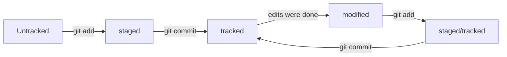

# Шпаргалка Git коммандам

## Начало работы
Необходимо сначала создать папку в ПК в любом директорий. После этого нужно открыть папку с помощью правой стороны мышки и выбрать **Git bash here**. Либо вы можете открыть git bash через поиск на панели задач и выполнить команду **mkdir наименованиеРепо**
Открывается коммандая строка git bash. Это значит вы создали репо _локально_. Теперь сделайте **git init** команду чтобы иницировать его. После этого
создайте текстовые документы с расширением txt или md (рекомендуется использовать только для readme файла) используя команду **touch наименованиеФайла.расширение**. После этого внесите необходимые изменения в этих файлах.
И выполните команду **git add --all**. 


## Создать удаленный репо

Для этого нужно зарегиться в [GitHub](www.github.com). И создать репо на нем. Можно следовать шагам который был продемонстрирован на этом [видеоинструкции](https://www.youtube.com/watch?v=u-_uGO95xco)

## Соединение локального и удаленного репо
Теперь нужно соединить репо в ПК с репо в github. Для этого сначала нужно коментить созданные файлы в локальном репо. Сделайте следующие команды **git commit -m "Ваше сообщение касательно коммента"**.
Нужно скопировать ссылку HTTPs/SSH в github и на gitbash выполнить следующую команду **git remote add origin ссылкаОтГитхаб**  После этого нужно совершить команду **git push -u origin master** или **git push -u origin main**. Все теперь можете проверить репо в github. Теперь каждый раз когда выполняете коммит, можно только сделать команду **git push**.

## Добавить раздел про HEAD
Файл HEAD — один из служебных файлов папки .git. Он указывает на коммит, который сделан последним (то есть на самый новый). Внутри HEAD — ссылка на служебный файл: refs/heads/master
А таким образом cat refs/heads/master # взяли ссылку из файла HEAD внутри хэш.

## Статусы файлов в Git
Существуют 4 статуса: untracked, tracked, staged, modified



## Чтобы отменить git add
git restore --staged fileName.extension    

## Чтобы отменить git commit
git reset --hard commitHashThatNeedsBeRevertedTO (not latest hash, but corresponding one)

## Чтобы отменить изменение в файле вообще 
git restore fileName

## Чтобы сравнить 2 коммитов или отследить изменения в файлах которые ранне закоммитировались
git diff           чтобы сравнить файлы после git commit -m ""

git diff --staged  чтобы сравнить файлы после git add

git diff hash1 hash2  чтобы сравнить между коммитами 

git diff hash1 HEAD   чтобы сравнить любой коммит с HEAD

git diff branchName1 branchName2     чтобы сравнить изменения между ветками

git diff branchName commitHashOfBranchName2     чтобы сравнить ветку с хэшом коммита другой ветки

git diff HEAD~ HEAD чтобы сравнить коммиты текущей ветки (текущий и предыдущий -1)

git diff branchName~ branchName   тоже самое что выше, чтобы сравнить коммиты внутри ветки с разницей -1

git diff latestHash~ latestHash тоже самое что выше, чтобы сравнить коммиты внутри ветки с разницей -1


## Управлять ветками
git branch  - чтобы проверить какие ветки есть и в каком находимся

git branch branchName - чтобы создать ветку

git checkout - чтобы переходить в другую ветку

git checkout -b branchName  - это комманда позволить за одно создать и переходить в данную ветку

git merge branchNameThatNeedsToMergeWith

git branch -d branchName1 branchName2

git push -u origin branchName - это для того чтобы пушить текущую ветку в удаленный gitHub репозиторий

```mermaid
  graph LR;
      git clone URL -- "project cloned to own PC" --> git checkout b brnch1;
      brnch1 -- "make modifications" --> git checkout master;
	  git pull -- "because someone already modifed it" --> git checkout brnch1;
	  git merge master -- "remote repo merged to your BRANCH" --> git push u origin brnch1;
```

## Дополнительные команды по работе с репо

```
rm наименованиеФайлаДляУдаление.расширение

rmdir наименованиеПапкикотораяПустая

rmdir -r  наименованиеПапкикотораяНеПустая

cat наименованиеФайлаКоторуюНужноПосмтреть содержание

pwd

ls

ls -a

cd наименованиеПапкикоторуюНужноПерейти 

cd  наименованиеПапкикоторуюНужноПерейти/которыйНаходитьсяВэтойПапке

cd ..

cd ~

cd /

cp наименованиеФайла.расширение /наименованиеПапкикоторуюНужноКопировать

mv наименованиеФайла.расширение /наименованиеПапкикоторуюНужноПереместить

rm -rf .Git

git status 

git log

ls -la .ssh/

ls -a ~/.ssh 

ssh-keygen -t ed25519 -C "электронная почта, к которой привязан ваш аккаунт на GitHub"

clip < ~/.ssh/id_ed25519.pub 

ssh -T git@github.com

git remote -v      чтобы проверить локальный и удаленный репос были соединены

git log --oneline

git commit --amend --no-edit

git commit --amend -m ""

echo "Message that will be added in the last line" >> fileName

echo "Message that will replace whole content of the file" > fileName

git clone URLfromGitHub

```


