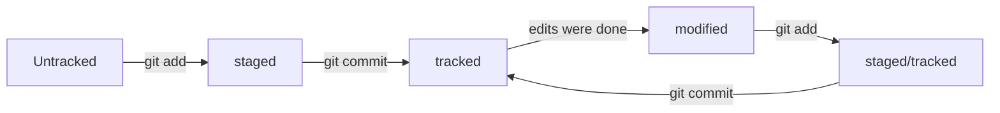

# Шпаргалка Git коммандам

## Начало работы
Необходимо сначала создать папку в ПК в любом директорий. После этого нужно открыть папку с помощью правой стороны мышки и выбрать **Git bash here**. Либо вы можете открыть git bash через поиск на панели задач и выполнить команду **mkdir наименованиеРепо**
Открывается коммандая строка git bash. Это значит вы создали репо _локально_. Теперь сделайте **git init** команду чтобы иницировать его. После этого
создайте текстовые документы с расширением txt или md (рекомендуется использовать только для readme файла) используя команду **touch наименованиеФайла.расширение**. После этого внесите необходимые изменения в этих файлах.
И выполните команду **git add --all**. 


## Создать удаленный репо

Для этого нужно зарегиться в [GitHub](www.github.com). И создать репо на нем. Можно следовать шагам который был продемонстрирован на этом [видеоинструкции](https://www.youtube.com/watch?v=u-_uGO95xco)

## Соединение локального и удаленного репо
Теперь нужно соединить репо в ПК с репо в github. Для этого сначала нужно коментить созданные файлы в локальном репо. Сделайте следующие команды **git commit -m "Ваше сообщение касательно коммента"**.
Нужно скопировать ссылку HTTPs/SSH в github и на gitbash выполнить следующую команду **git remote add origin ссылкаОтГитхаб**  После этого нужно совершить команду **git push -u origin master** или **git push -u origin main**. Все теперь можете проверить репо в github. Теперь каждый раз когда выполняете коммит, можно только сделать команду **git push**.

## Добавить раздел про HEAD
Файл HEAD — один из служебных файлов папки .git. Он указывает на коммит, который сделан последним (то есть на самый новый). Внутри HEAD — ссылка на служебный файл: refs/heads/master
А таким образом cat refs/heads/master # взяли ссылку из файла HEAD внутри хэш.

## Статусы файлов в Git
Существуют 4 статуса: untracked, tracked, staged, modified




## Дополнительные команды по работе с репо

```

rm наименованиеФайлаДляУдаление.расширение
rmdir наименованиеПапкикотораяПустая
rmdir -r  наименованиеПапкикотораяНеПустая
cat наименованиеФайлаКоторуюНужноПосмтреть содержание
pwd
ls
ls -a
cd наименованиеПапкикоторуюНужноПерейти
cd  наименованиеПапкикоторуюНужноПерейти/которыйНаходитьсяВэтойПапке
cd ..
cd ~
cd /
cp наименованиеФайла.расширение /наименованиеПапкикоторуюНужноКопировать
mv наименованиеФайла.расширение /наименованиеПапкикоторуюНужноПереместить
rm -rf .Git
git status
git log
ls -la .ssh/
ls -a ~/.ssh 
ssh-keygen -t ed25519 -C "электронная почта, к которой привязан ваш аккаунт на GitHub"
clip < ~/.ssh/id_ed25519.pub 
ssh -T git@github.com
git remote -v
git log --oneline

```


